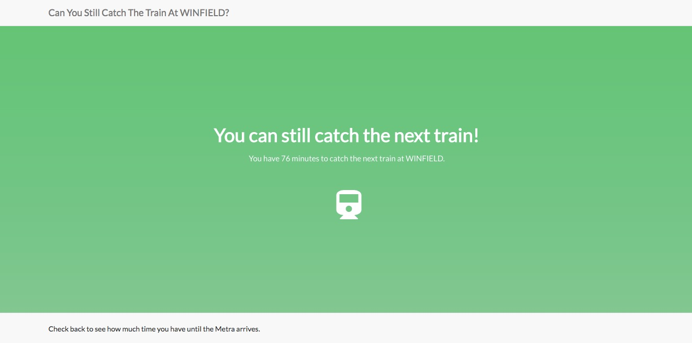

# Train Tracker

## How It Works

When you navigate to the root, the app makes an API call to freegeoip.net, which approximates your location based on your IP address. 

Next it finds the Metra station nearest to your location (Chicago only). 

It then determines the next time a passenger train will be at that station.

Finally, it calculates how long it will take you to drive from your current location to the nearest train station. It compares that time to the time until the next train arrival, and lets you know if you can make it in time.

## Technical Components

Built with Sinatra, Ruby, Metra CSV train schedules, freegeoip.net, and the Google Maps location API.

## How To Run It

1. Clone the repo to your local machine
2. cd into the directory
3. Run 'bundle install'
4. Run 'ruby app.rb'
5. Open 'localhost:4567' in your browser

